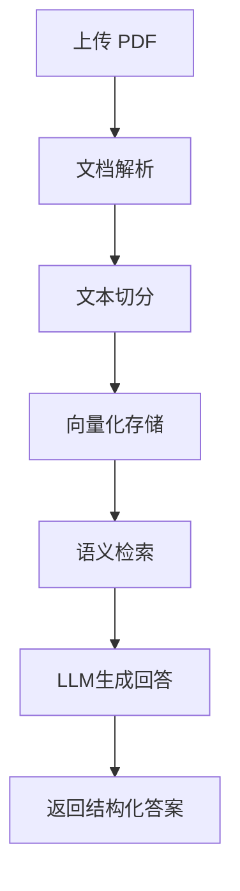

# 文档智能问答系统 (RAG) 


# 📄 DocMind AI - 文档智能问答助手

## 🧠 项目简介（产品视角）
DocMind AI 是一款面向学习与知识管理场景的文档智能助手，用户只需上传 PDF，即可快速获取文档核心信息，并通过对话形式进行深度问答。

区别于传统“Ctrl + F”搜索，系统基于语义理解能力，能够：
- 自动提取重点
- 理解上下文
- 生成结构化回答

帮助用户实现 **从“找信息” → “直接获得答案”** 的效率跃迁。

---

## 🎯 使用场景

### 👩‍🎓 学生 / 考试党
- 快速总结教材重点
- 复习时提问知识点

### 🧑‍💼 求职 / 办公人群
- 阅读简历 / 报告并提取关键信息
- 快速理解长文档内容

### 📚 自我学习者
- 阅读论文、电子书
- 做知识整理与问答

👉 核心解决问题：
> ❌ 文档太长看不完  
> ❌ 找信息效率低  
> ❌ 无法快速理解重点  

---

## ⚙️ 核心功能（流程）


## 技术栈
```mermaid
- Python
- LangChain
- LangGraph
- LLM API
- FAISS（基础使用）
- React
- Git
```

## 项目结构示例
```mermaid
rag-project/
├─ app.py # Flask 服务入口
├─ rag_core.py # 核心逻辑：PDF 解析、向量化、问答
├─ requirements.txt # 项目依赖
├─ README.md # 项目说明
├─ static/ # 前端静态资源
├─ templates/ # 前端模板
└─ .gitignore
```
## 页面展示

## 安装与运行

1. 克隆仓库
```bash
git clone https://github.com/你的用户名/rag-project.git
cd rag-project
```
2. 创建并激活虚拟环境
```bash
python -m venv .venv
# Windows
.venv\Scripts\activate
# macOS/Linux
source .venv/bin/activate
```
3. 安装依赖
```bash
pip install -r requirements.txt
```
4. 启动 Flask 服务
```bash
python app.py
```
5. 打开浏览器访问
```bash
http://127.0.0.1:5000
```
---
### 使用说明
- 上传 PDF 文件
- 系统自动解析并构建向量库
- 提问系统会基于 PDF 内容生成回答
- 请勿上传敏感信息或大文件到 GitHub
- API Key 等敏感信息请放在 .env 文件中，并添加到 .gitignore